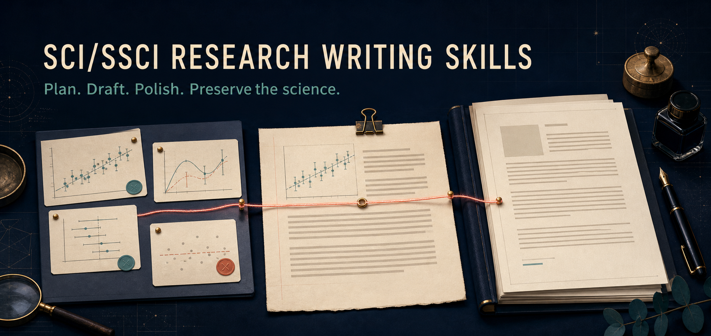
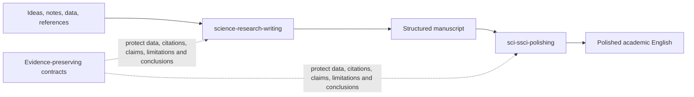

<div align="center">
  
</div>

# SCI/SSCI Research Writing Skills

> **From research materials to a structured manuscript—without invented evidence, inflated claims, or rewritten science.**

Open-source Agent Skills for planning, drafting, revising, translating, and polishing research papers. The repository combines a classic section-by-section research-writing method with writing observations derived through a curated SCI/SSCI corpus pipeline.

<p align="center">
  <a href="README_CN.md">中文说明</a> ·
  <a href="docs/science-research-writing/getting-started.md">1-minute start</a> ·
  <a href="#install">Install</a> ·
  <a href="#build-on-these-mechanisms">Reuse &amp; cite</a>
</p>

## Two foundations, one research-writing workflow

This repository does two connected jobs:

| Foundation | Skill | What it helps you do |
|---|---|---|
| The section-by-section and reverse-engineering pedagogy associated with Hilary Glasman-Deal's *Science Research Writing* | [`science-research-writing`](skills/science-research-writing/SKILL.md) | Decide what each section needs to accomplish, then turn ideas, notes, data, references, or drafts into the next useful manuscript artifact |
| Writing observations derived through a corpus pipeline beginning with a 1,000-paper SCI/SSCI metadata candidate pool | [`sci-ssci-polishing`](skills/sci-ssci-polishing/SKILL.md) | Translate or polish an existing manuscript while preserving data, citations, terminology, limitations, and claim strength |

In plain language: **a research-writing classic informs how to build the paper; a curated SCI/SSCI corpus informs how to communicate it.** Together, the two Skills help researchers produce clearer, better-structured, and more evidence-faithful manuscripts. Scientific judgment remains with the author.



## Choose where you are

| What you have now | Use | What you get |
|---|---|---|
| An idea or research question | `science-research-writing` | Questions to resolve, a materials checklist, and a practical next step |
| Notes, data, references, or a protocol | `science-research-writing` | A paper plan or section draft grounded only in supplied materials |
| A partial or complete draft | `science-research-writing` | Revision, consistency checks, or an evidence audit |
| Chinese academic prose or an English manuscript | `sci-ssci-polishing` | Academic English plus a preservation audit |

## Start with one sentence

```text
Use $science-research-writing to help me write my paper.
Here are the materials I currently have: [attach files or paste text]
```

The Skill reads what you have, identifies whether the next useful result is a plan, draft, revision, or audit, and proceeds without requiring a long intake prompt or an internal mode selection.

[Getting started](docs/science-research-writing/getting-started.md) · [Use cases](docs/science-research-writing/use-cases.md) · [Copyable inputs](docs/science-research-writing/input-examples.md) · [Output guide](docs/science-research-writing/output-guide.md)

## Install

Node.js 18 or later is required.

```bash
# Start from research materials
npx skills add Yila-AI/sci-ssci-skills --global --agent codex --skill science-research-writing --yes --copy

# Translate or polish an existing draft
npx skills add Yila-AI/sci-ssci-skills --global --agent codex --skill sci-ssci-polishing --yes --copy
```

List all installable Skills:

```bash
npx skills add Yila-AI/sci-ssci-skills --list
```

## Why turn *Science Research Writing* into an Agent workflow?

Hilary Glasman-Deal's *Science Research Writing: For Native and Non-Native Speakers of English* is valued because it teaches more than phrases and grammar. Its section-by-section approach asks what a reader needs from each part of an empirical paper, while its reverse-engineering pedagogy encourages researchers to examine successful papers in their own field and adapt recurring functions without copying sentences.

An independent review reports that the first edition sold more than 35,000 copies and was translated into Chinese, Korean, and Japanese ([Anna Clemens, 2020](https://annaclemens.com/blog/book-review-science-research-writing-hilary-glasman-deal/)).

The central idea can be summarized as seven reader questions:

| Manuscript section | The reader's question |
|---|---|
| Introduction | Why was this study needed? |
| Methods | What exactly was done? |
| Results | What was found? |
| Discussion | What do the findings mean—and what do they not mean? |
| Conclusion | What can the evidence actually support? |
| Abstract | What must a reader understand in one minute? |
| Title | What does the paper promise? |

`science-research-writing` operationalizes this general approach for Agent use and adds automatic task routing, target-journal modeling, evidence provenance, author-confirmation boundaries, and deterministic draft checks.

It is an independent, unofficial project. It is not affiliated with or endorsed by the author or World Scientific, and it does not reproduce the book, exercises, answer key, phrase lists, sample passages, or page content. See the [privacy and copyright boundaries](docs/science-research-writing/privacy-and-copyright.md).

## Fluent is not always faithful

Suppose 120 university students rate nine milk-tea recipes. The evidence shows that 30%-sugar oolong milk tea receives the highest average rating among these participants.

**Supported by the study:**

> Among the participants in this study, 30%-sugar oolong milk tea received the highest rating.

**Not supported by the study:**

> 30%-sugar oolong milk tea is the world's best milk-tea recipe.

The first statement reports a bounded result. The second silently turns a local finding into a universal claim. Both Skills are designed to detect this kind of drift: evidence can be clarified, organized, translated, and polished, but it must not be silently strengthened.

## What the two Skills add

### `science-research-writing`

- routes an idea, materials, partial draft, or full draft to the next useful task;
- maps Introduction, Methods, Results, Discussion, Conclusion, Abstract, and Title by reader question and rhetorical function;
- models target-journal functions and variation without storing copied prose;
- records the source of consequential statements and marks missing evidence;
- checks numbers, citations, protected terms, and claim-strength markers;
- gives novice-readable outputs and asks no more than one blocking question at a time.

### `sci-ssci-polishing`

- translates Chinese academic prose into publication-oriented English;
- polishes English paragraphs and complete manuscript sections;
- improves information order, clarity, cohesion, and academic tone;
- preserves numbers, statistics, technical entities, citations, null results, limitations, and conclusions;
- refuses to invent mechanisms, references, results, or implications merely to make prose sound more complete.

## The 1,000-paper evidence pool—what it does and does not mean

The polishing Skill began with a **1,000-paper SCI/SSCI metadata candidate pool** and used staged screening to build a balanced core portfolio:

```text
1,000-paper metadata candidate pool
                 ↓
        200-paper balanced shortlist
                 ↓
          60-paper core portfolio
        ↙           ↓           ↘
40 distillation  10 calibration  10 sealed blind evaluation
```

The 60-paper portfolio contains 30 SCI and 30 SSCI papers across nine broad discipline clusters. The 40-paper distillation split contains 20 SCI and 20 SSCI papers from 28 journals, yielding aggregate observations from 1,750 usable paragraphs and 220,158 words.

Here, **distillation does not mean model fine-tuning or copying journal sentences**. It means abstracting recurring rhetorical functions, information order, evidence boundaries, and failure modes into reusable editing rules. The 1,000-paper pool is a screening universe: it is not a claim that 1,000 full texts were downloaded, read, distilled, or used to train a model.

[Corpus method](skills/sci-ssci-polishing/references/corpus-method.md) · [Selection method](corpus/selection-rubric.md) · [Corpus summary](corpus/corpus-summary.md) · [Public metadata](corpus/README.md)

## Build on these mechanisms

The following mechanisms are documented as reusable components for other research Agents and academic-writing projects:

| Featured mechanism | What it protects or enables |
|---|---|
| [Evidence-Preserving Draft Contract](skills/science-research-writing/SKILL.md) | Prevents unsupported intellectual content during planning, drafting, and revision |
| [Claim-Strength Contract](skills/science-research-writing/references/certainty-and-claim-strength.md) | Prevents silent movement between suggestion, association, prediction, effect, and causation |
| [Target-Journal Model Builder](skills/science-research-writing/references/reverse-engineering-protocol.md) | Learns rhetorical functions and variation without copying target-paper wording |

Additional components include the [Section Function Map](skills/science-research-writing/assets/section-function-map.md), [Content Provenance Ledger](skills/science-research-writing/assets/evidence-ledger.csv), [Title-Paper Promise Check](skills/science-research-writing/references/title.md), and [Draft Invariant Checker](skills/science-research-writing/scripts/check_draft_invariants.py).

Suggested short credit:

```markdown
**Credit:** The evidence-preserving research-writing workflow is adapted from
[Yila-AI/sci-ssci-skills](https://github.com/Yila-AI/sci-ssci-skills),
including its Evidence-Preserving Draft Contract and Claim-Strength Contract.
```

Reuse remains subject to the repository license and any applicable third-party rights.

## Evaluation

Evaluation claims remain Skill-specific.

### `sci-ssci-polishing`

| Evaluation | Result |
|---|---:|
| Frozen synthetic transformation cases | 6/6 passed |
| Verified blind full texts available | 9/10 |
| Publication-grade retention cases | 18/18 passed |
| Invented scientific content | 0/18 |
| Changed numbers or citation markers | 0/18 |
| Unnecessary rewrites | 0/18 |

[Synthetic cases](benchmarks/synthetic-cases.md) · [Synthetic outputs](benchmarks/synthetic-case-outputs.md) · [Blind retention report](benchmarks/blind-retention-results.md)

### `science-research-writing`

The test set and scoring rubric were frozen before implementation. Comparative results will be added only after raw outputs, model settings, case-level scores, failures, and limitations are available.

[Benchmark protocol](benchmarks/science-research-writing/README.md) · [Frozen cases](benchmarks/science-research-writing/test-cases.json) · [Evaluation rubric](benchmarks/science-research-writing/evaluation-rubric.md) · [Development smoke tests](benchmarks/science-research-writing/smoke-test-results.md)

These evaluations support narrow safety and consistency claims. They do not prove journal acceptance, universal disciplinary coverage, scientific correctness, or superiority to domain experts and professional editors.

## Copyright, data, and professional boundaries

- The repository contains no book PDF, article PDF, subscription full text, extracted paper paragraphs, phrase bank, or private access trace.
- Public corpus tables contain bibliographic metadata, screening annotations, and aggregate results only.
- `SCI` and `SSCI` describe corpus and user scope. This independent project is not affiliated with Clarivate, any journal, author, or publisher.
- Both Skills are public beta software and do not replace author, domain-specialist, statistical, ethical, or professional editorial review.

## Citation and license

See [`CITATION.cff`](CITATION.cff) for formal citation metadata. Original code, Skill instructions, and project documentation are licensed under the [Apache License 2.0](LICENSE). Third-party facts, names, and external resources remain subject to their source terms.
