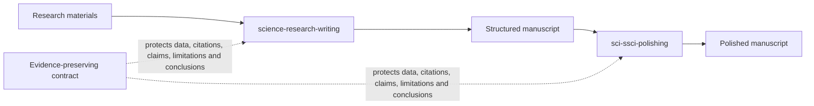

<div align="center">
  
</div>

# SCI/SSCI Research Writing Skills

> **Plan. Draft. Polish. Preserve the science.**

Open-source Agent Skills for turning research materials into evidence-faithful empirical papers, then improving the language without rewriting the science.

<p align="center"><a href="README_CN.md">中文</a></p>

## Choose your workflow

| You need to... | Use |
|---|---|
| Turn research materials into a paper plan, section draft, revision, or evidence audit | [`science-research-writing`](skills/science-research-writing/SKILL.md) |
| Translate or polish an existing manuscript without rewriting the science | [`sci-ssci-polishing`](skills/sci-ssci-polishing/SKILL.md) |



## Install

Node.js 18 or later is required.

```bash
# Write from research materials
npx skills add Yila-AI/sci-ssci-skills --global --agent codex --skill science-research-writing --yes --copy

# Translate or polish an existing draft
npx skills add Yila-AI/sci-ssci-skills --global --agent codex --skill sci-ssci-polishing --yes --copy
```

List all installable Skills:

```bash
npx skills add Yila-AI/sci-ssci-skills --list
```

## Start with one sentence

```text
Use $science-research-writing to help me write my paper.
Here are my current materials: [attach files or paste text]
```

The Skill reads the materials, identifies whether you need a plan, draft, revision, or audit, and produces the next useful result. It does not require a long intake prompt or force the user to choose internal modes.

[One-minute guide](docs/science-research-writing/getting-started.md) · [Use cases](docs/science-research-writing/use-cases.md) · [Copyable inputs](docs/science-research-writing/input-examples.md) · [Output guide](docs/science-research-writing/output-guide.md)

## Featured Skill: Science Research Writing

`science-research-writing` is an independent, unofficial Agent Skill inspired by the reverse-engineering pedagogy and section-by-section writing approach presented in Hilary Glasman-Deal's *Science Research Writing: For Native and Non-Native Speakers of English* (2nd ed., World Scientific, 2020).

The book is a widely valued practical guide among researchers learning to write empirical papers in English. Its reverse-engineering approach asks writers to examine successful papers in their own field, identify how sections meet reader expectations, test those patterns against target articles, and adapt the resulting model to their own research. A detailed independent review reports that the first edition sold more than 35,000 copies and was translated into Chinese, Korean, and Japanese ([Anna Clemens, 2020](https://annaclemens.com/blog/book-review-science-research-writing-hilary-glasman-deal/)).

This Skill operationalizes that general approach for Agent use while adding original safeguards:

- automatic routing from idea, materials, partial draft, or full draft;
- section-function workflows for Introduction, Methods, Results, Discussion, Conclusion, Abstract, and Title;
- target-journal modeling that stores functions and variation, not copied prose;
- evidence provenance and author-confirmation boundaries;
- deterministic audits of numbers, citations, protected terms, and semantic markers;
- novice-readable outputs with no more than one blocking question at a time.

This project is not affiliated with or endorsed by the author or World Scientific. It does not reproduce the book, exercises, answer key, phrase lists, sample passages, or page content. See [privacy and copyright boundaries](docs/science-research-writing/privacy-and-copyright.md).

## Reusable mechanisms

These components have stable documentation so other research-agent projects can reuse and cite them directly:

| Mechanism | What it protects or enables |
|---|---|
| [Target-Journal Model Builder](skills/science-research-writing/references/reverse-engineering-protocol.md) | Learns rhetorical functions without copying target-paper wording |
| [Section Function Map](skills/science-research-writing/assets/section-function-map.md) | Maps reader questions, functions, evidence, and boundaries |
| [Evidence-Preserving Draft Contract](skills/science-research-writing/SKILL.md) | Prevents unsupported intellectual content during drafting |
| [Content Provenance Ledger](skills/science-research-writing/assets/evidence-ledger.csv) | Records where consequential statements come from |
| [Claim-Strength Contract](skills/science-research-writing/references/certainty-and-claim-strength.md) | Prevents silent movement between suggestion, association, prediction, effect, and causation |
| [Title-Paper Promise Check](skills/science-research-writing/references/title.md) | Tests whether every title promise is supported by the paper |
| [Draft Invariant Checker](skills/science-research-writing/scripts/check_draft_invariants.py) | Flags token drift and semantic-marker changes |

Suggested attribution:

```markdown
**Credit:** The evidence-preserving research-writing workflow is adapted from
[Yila-AI/sci-ssci-skills](https://github.com/Yila-AI/sci-ssci-skills),
including its Target-Journal Model Builder and claim-strength controls.
```

## SCI/SSCI Polishing

`sci-ssci-polishing` translates Chinese academic prose into publication-oriented English and polishes existing English paragraphs or complete sections.

Its preservation-first workflow is:

```text
classify -> lock invariants -> route by section -> revise -> audit
```

It will not invent mechanisms, citations, data, limitations, or implications merely to make prose sound more complete or more "top-journal-like."

### The 1,000-paper evidence pool

The polishing Skill began with a 1,000-paper SCI/SSCI metadata candidate pool and used staged screening to build a balanced 60-paper core portfolio:

```text
1,000-paper metadata candidate pool
                 ↓
        200-paper balanced shortlist
                 ↓
          60-paper core portfolio
        ↙           ↓           ↘
40 distillation  10 calibration  10 sealed blind evaluation
```

Distillation means abstracting recurring rhetorical functions, information order, evidence boundaries, and failure modes. It does not mean model fine-tuning or copying journal sentences. The 1,000-paper pool is a screening universe, not a claim that 1,000 full texts were downloaded or used to train a model.

[Corpus method](skills/sci-ssci-polishing/references/corpus-method.md) · [Selection method](corpus/selection-rubric.md) · [Corpus summary](corpus/corpus-summary.md) · [Public metadata](corpus/README.md)

## Evaluation

Evaluation claims remain Skill-specific.

### `sci-ssci-polishing`

| Evaluation | Result |
|---|---:|
| Frozen synthetic transformation cases | 6/6 passed |
| Verified blind full texts available | 9/10 |
| Publication-grade retention cases | 18/18 passed |
| Invented scientific content | 0/18 |
| Changed numbers or citation markers | 0/18 |
| Unnecessary rewrites | 0/18 |

[Synthetic cases](benchmarks/synthetic-cases.md) · [Synthetic outputs](benchmarks/synthetic-case-outputs.md) · [Blind retention report](benchmarks/blind-retention-results.md)

### `science-research-writing`

The test set and scoring rubric were frozen before implementation. Comparative results will be added only after all raw outputs, model settings, case-level scores, failures, and limitations are available.

[Benchmark protocol](benchmarks/science-research-writing/README.md) · [Frozen cases](benchmarks/science-research-writing/test-cases.json) · [Evaluation rubric](benchmarks/science-research-writing/evaluation-rubric.md) · [Development smoke tests](benchmarks/science-research-writing/smoke-test-results.md)

These evaluations support narrow safety and consistency claims. They do not prove journal acceptance, universal disciplinary coverage, scientific correctness, or superiority to domain experts and professional editors.

## Copyright, data, and affiliation boundaries

- The repository contains no book PDF, article PDF, subscription full text, extracted paper paragraphs, phrase bank, or private access trace.
- Public corpus tables contain bibliographic metadata, screening annotations, and aggregate results only.
- `SCI` and `SSCI` describe corpus and user scope. This independent project is not affiliated with Clarivate, any journal, author, or publisher.
- Both Skills are public beta software and do not replace author, specialist, statistical, ethical, or professional editorial review.

## Citation and license

See [`CITATION.cff`](CITATION.cff) for repository citation metadata. Original code, Skill instructions, and project documentation are licensed under the [Apache License 2.0](LICENSE). Third-party facts, names, and external resources remain subject to their source terms.
