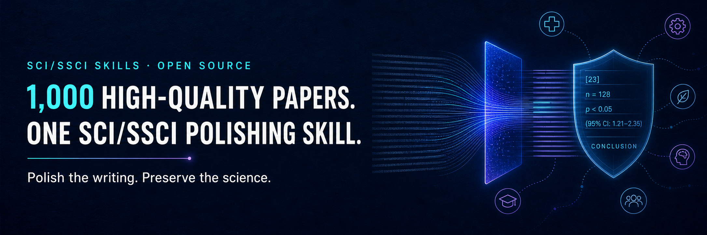

<div align="center">
  
</div>

<p align="center">
  <a href="README.md">English</a>
</p>

# SCI/SSCI Skills

> 只润色表达，不改写科学。

`sci-ssci-skills` 是一组面向科研写作的开源 Agent Skills。首个 Skill `sci-ssci-polishing` 支持：

- 中文学术段落或章节翻译为学术英文；
- 英文论文段落与完整章节润色；
- 按 Abstract、Introduction、Methods、Results、Discussion 和 Conclusion 路由表达策略；
- 在语言修订前后审计数据、统计量、术语、引用、论断强度、局限与结论。

## 为什么不是一句“Please polish”？

通用润色往往只优化流畅度，却可能把 `was associated with` 改成 `led to`，把零结果或限定条件顺手删掉。

`sci-ssci-polishing` 采用一个保真工作流：

```text
判断任务 -> 锁定不可变信息 -> 识别章节功能 -> 润色 -> 逐项审计
```

它不会为了让句子看起来更“高级”，擅自新增机制、文献、数据、局限或实践意义。

## 语料和“蒸馏”是什么？

本项目的 V2 建立了一个 **1,000 篇论文的元数据候选池**，然后经过分层筛选：

```text
1,000 篇元数据候选论文
               ↓
        200 篇平衡候选
               ↓
          60 篇核心语料
       ↙          ↓          ↘
40 篇蒸馏   10 篇校准   10 篇封闭盲测
```

最终 60 篇中 SCI 和 SSCI 各 30 篇，覆盖 9 个跨学科组合。其中 40 篇蒸馏集来自 28 本期刊，产生了 1,750 个可用段落、220,158 个英文词的聚合观察。

这里的“蒸馏”不是微调模型，也不是复制顶刊句子，而是提炼跨论文重复出现的章节功能、信息顺序、证据边界和失败模式，再把它们编码成可复用的 Skill 规则。

[查看语料方法](skills/sci-ssci-polishing/references/corpus-method.md) · [查看筛选标准](corpus/selection-rubric.md) · [查看语料分布](corpus/corpus-summary.md)

## 安装

需要 Node.js 18 或更高版本。

```bash
npx skills add Yila-AI/sci-ssci-skills --global --agent codex --skill sci-ssci-polishing --yes --copy
```

查看仓库中可安装的 Skills：

```bash
npx skills add Yila-AI/sci-ssci-skills --list
```

## 快速使用

```text
使用 $sci-ssci-polishing 把下面的中文 Results 段落翻译成学术英文。
保留所有数字、统计量、术语、引用和因果限定。
```

```text
使用 $sci-ssci-polishing 润色下面的 SSCI Discussion 章节。
改善跨段衔接，但不要改变论断、引用、局限或结论。
```

默认输出包含：

1. 润色后英文；
2. 关键语言或组织修改；
3. 保真审计；
4. 必要时的作者确认问题。

## 当前评测

| 评测 | 结果 |
|---|---:|
| 冻结的合成转换案例 | 6/6 通过 |
| 盲测全文获取 | 9/10 |
| 发表级原文保留案例 | 18/18 通过 |
| 发明的科学内容 | 0/18 |
| 不必要重写 | 0/18 |

盲测主要检验“遇到已经很好的正式发表文字时，Skill 能否克制不改”。它不等于独立人类评分，也不能证明期刊录用率。

[查看合成案例](benchmarks/synthetic-cases.md) · [查看盲测结果](benchmarks/blind-retention-results.md)

## 学术与版权边界

- 本仓库不包含论文 PDF、订阅全文、大段原文或私有解析文件。
- 公开语料表仅保留书目元数据、筛选标签和聚合结果。
- `SCI` 和 `SSCI` 在本项目中用于描述研究语料范围；本项目与 Clarivate 或任何期刊、出版商无隶属关系。
- Skill 是公开测试版，不替代作者、领域专家或专业编辑的最终审核。

## License

原创代码、Skill 指令和项目文档使用 [Apache License 2.0](LICENSE)。第三方书目事实与外部资源受各自来源条款约束，详见 [数据说明](corpus/README.md)。
