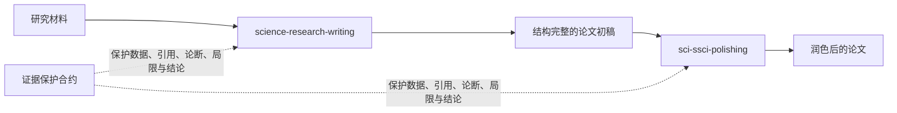

# SCI/SSCI 科研写作 Skills

> **规划、起草、润色，保护科学内容。**

从研究材料到英文论文：两个开源 Agent Skills，一条证据保真的科研写作工作流。

<p align="center"><a href="README.md">English</a></p>



## 选择你的工作流

| 你需要做什么 | 使用 |
|---|---|
| 把研究材料变成论文计划、章节初稿、修改稿或证据审计 | [`science-research-writing`](skills/science-research-writing/SKILL.md) |
| 翻译或润色已有论文，不改写科学内容 | [`sci-ssci-polishing`](skills/sci-ssci-polishing/SKILL.md) |

## 安装

```bash
# 从研究材料开始写论文
npx skills add Yila-AI/sci-ssci-skills --global --agent codex --skill science-research-writing --yes --copy

# 翻译或润色已有初稿
npx skills add Yila-AI/sci-ssci-skills --global --agent codex --skill sci-ssci-polishing --yes --copy
```

## 一句话开始

```text
使用 $science-research-writing 帮我写论文。
这是我目前已有的材料：[附件或文本]
```

Skill 会先读取材料，判断你需要的是计划、起草、修改还是审计，然后给出当前最有用的结果。用户不需要编写长 Prompt，也不需要选择内部模式。

[一分钟英文指南](docs/science-research-writing/getting-started.md) · [使用场景](docs/science-research-writing/use-cases.md) · [可复制的输入示例](docs/science-research-writing/input-examples.md)

## 主推 Skill：Science Research Writing

`science-research-writing` 是一个独立、非官方的 Agent Skill，受 Hilary Glasman-Deal 著作 *Science Research Writing: For Native and Non-Native Speakers of English* 第二版中“逆向分析目标论文”和分章节教学思路启发。

这本书鼓励研究者观察自己领域的优秀论文，识别各章节如何回答读者问题，再将得到的模型调整到自己的研究上。一篇独立书评报道，第一版销量超过 35,000 册，并被翻译为中文、韩文和日文（[Anna Clemens, 2020](https://annaclemens.com/blog/book-review-science-research-writing-hilary-glasman-deal/)）。

我们将这种通用教学思路转化为 Agent 可以执行的工作流，并增加了原创机制：

- 根据想法、材料、局部初稿或完整初稿自动路由；
- Introduction、Methods、Results、Discussion、Conclusion、Abstract 和 Title 章节功能模块；
- 只学习功能与结构、不复制原句的目标期刊建模；
- 证据来源记录和作者确认边界；
- 数字、引用、保护术语和论断标记的确定性检查。

本项目与作者或 World Scientific 无隶属和背书关系，不复制原书、练习、答案、句库、示例段落或页面内容。

## 可被其他项目复用和引用的机制

| 机制 | 用途 |
|---|---|
| [Target-Journal Model Builder](skills/science-research-writing/references/reverse-engineering-protocol.md) | 从目标论文学习功能，不复制原句 |
| [Section Function Map](skills/science-research-writing/assets/section-function-map.md) | 映射读者问题、信息功能、证据与边界 |
| [Evidence-Preserving Draft Contract](skills/science-research-writing/SKILL.md) | 防止起草时新增无依据学术内容 |
| [Content Provenance Ledger](skills/science-research-writing/assets/evidence-ledger.csv) | 记录关键陈述的来源 |
| [Claim-Strength Contract](skills/science-research-writing/references/certainty-and-claim-strength.md) | 防止提示、相关、预测和因果静默漂移 |
| [Title-Paper Promise Check](skills/science-research-writing/references/title.md) | 检查标题承诺是否被正文支持 |

## SCI/SSCI Polishing

`sci-ssci-polishing` 用于将中文学术文字翻译为英文，或润色已有英文段落和完整章节。它使用一个保真优先工作流：

```text
判断任务 -> 锁定不可变信息 -> 识别章节功能 -> 润色 -> 逐项审计
```

### 1000 篇论文证据池

润色 Skill 从 1,000 篇 SCI/SSCI 元数据候选论文出发，通过分层筛选建立了 60 篇平衡核心组合。这里的“蒸馏”是提炼章节功能、信息顺序、证据边界和失败模式，不是模型微调，也不是复制期刊句子。

[语料方法](skills/sci-ssci-polishing/references/corpus-method.md) · [筛选标准](corpus/selection-rubric.md) · [语料分布](corpus/corpus-summary.md)

## 评测

两个 Skill 的评测结果必须分开。现有 1000 篇论文语料和 18 个保留案例只支持 `sci-ssci-polishing` 的狭义安全性结论。

`science-research-writing` 的测试集和评分规则已在实现前冻结。只有在公开原始输出、模型设置、逐案分数、失败和局限之后，才会增加效果对比。

[新 Skill 评测协议](benchmarks/science-research-writing/README.md) · [冻结案例](benchmarks/science-research-writing/test-cases.json) · [评分标准](benchmarks/science-research-writing/evaluation-rubric.md) · [开发烟测记录](benchmarks/science-research-writing/smoke-test-results.md)

## 版权、数据与声明

- 仓库不包含书籍 PDF、论文 PDF、订阅全文、抽取段落或私有访问记录。
- `SCI` 和 `SSCI` 用于描述语料和用户范围；本项目与 Clarivate、期刊、作者或出版社无隶属关系。
- Skill 不替代作者、领域专家、统计学家、伦理审查或专业编辑。

## Citation 与 License

引用信息见 [`CITATION.cff`](CITATION.cff)。原创代码、Skill 指令和项目文档使用 [Apache License 2.0](LICENSE)。
