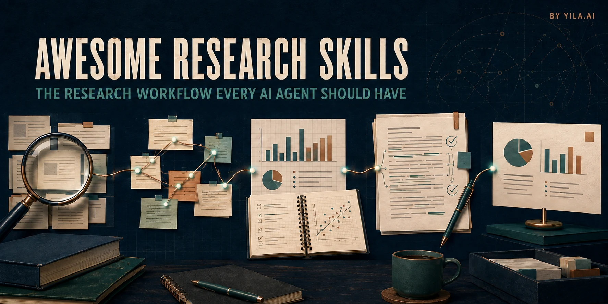

# Awesome Research Skills

[English](README.md) · [中文](README_CN.md) · [한국어](README_ko.md)

<p align="center">
  
</p>

> **すべての AI Agent に必要な研究ワークフロー。**

文献の発見と理解から、執筆、レビュー、推敲、発表まで、研究ライフサイクル全体を支援する成長中のオープンソース Skill スタックです。

現在は研究執筆、忠実な学術推敲、学術文の AI テンプレート表現の除去、論文からスライドへの変換を提供しています。今後さらに多くの研究段階へ拡張します。すべての段階で、Agent は出典、確認事項、不確実性、変更点を明示し、研究内容を勝手に書き換えないことを重視します。

本プロジェクトは **[Yila.ai](https://yila.ai/?utm_source=github&utm_medium=referral&utm_campaign=awesome-research-skills)** が開発・保守しています。Yila.ai では、文献、証拠、データ、執筆、発表をつなぐ統合研究ワークスペースを利用できます。

Codex、Claude Code、その他の再利用可能な Skill 指示に対応する Agent で利用できます。この日本語ページは要点版です。詳細な資料は英語版と中国語版で管理されています。

## 今のタスクから始める

| やりたいこと | 使用するモジュール | 出力 |
|---|---|---|
| アイデア、メモ、データ、文献を論文にまとめる | **Research Writer** · [`science-research-writing`](skills/science-research-writing/SKILL.md) | 証拠に基づく計画、セクション草稿、改訂、または原稿監査 |
| 研究内容を変えずに学術英語を改善する | **Paper Polisher** · [`sci-ssci-polishing`](skills/sci-ssci-polishing/SKILL.md) | 投稿向けの英文と保全監査 |
| 科学的内容を変えずに AI 的な定型表現を減らす | **Academic Humanizer** · [`academic-humanizer`](skills/academic-humanizer/SKILL.md) | より自然で具体的な文章、パターン監査、保全監査 |
| 論文や研究結果を発表に変換する | **Paper to Slides** · [`research-presentation`](skills/research-presentation/SKILL.md) | 編集可能で出典に基づくデッキ計画、ノート、出典マップ、視覚 QA |

## 30 秒でインストール

インストーラーには Node.js 18 以降が必要です。現在利用可能な機能をすべてインストールするには：

```bash
npx skills add Yila-AI/awesome-research-skills --global --agent codex --skill '*' --yes --copy
```

必要な機能だけをインストールすることもできます。

```bash
# 論文の計画、執筆、改訂、監査
npx skills add Yila-AI/awesome-research-skills --global --agent codex --skill science-research-writing --yes --copy

# 既存原稿の翻訳または推敲
npx skills add Yila-AI/awesome-research-skills --global --agent codex --skill sci-ssci-polishing --yes --copy

# 学術文の AI 的な定型表現を減らす
npx skills add Yila-AI/awesome-research-skills --global --agent codex --skill academic-humanizer --yes --copy

# 論文や研究結果を学術発表に変換
npx skills add Yila-AI/awesome-research-skills --global --agent codex --skill research-presentation --yes --copy
```

利用可能な Skill の一覧は、`npx skills add Yila-AI/awesome-research-skills --list` で表示できます。

## 研究ライフサイクル

```text
問い → 発見 → 読解 → 統合 → 設計 → 分析 → 執筆 → レビュー → 推敲 → 発信
```

| 開発状況 | 研究段階 |
|---|---|
| **現在利用可能** | 執筆、推敲、定型表現の除去、研究発表 |
| **次に開発** | 文献検索、論文読解、証拠の統合、研究レビュー |
| **長期的な範囲** | 研究設計、データ分析、出版、より広い研究コミュニケーション |

将来的には、単一の `$research` 入口が現在の研究段階を判断し、適切な専門モジュールへ処理を振り分けます。統一入口は開発中であり、現在は利用可能な各 Skill を直接呼び出します。

オープンソース化が進行中の段階も含め、文献検索、論文読解、証拠統合、研究設計、データ分析、執筆、図、ポスター、スライドの統合ワークフローは **[Yila.ai で試せます →](https://yila.ai/?utm_source=github&utm_medium=referral&utm_campaign=awesome-research-skills)**

## すぐに使う

```text
Use $science-research-writing.
I have research materials but do not know how to organize them into a paper.
Here are my research question, methods, main results, and target journal:
[paste materials]
```

```text
Use $sci-ssci-polishing.
Please polish this Discussion paragraph without changing numbers, citations,
terminology, limitations, or claim strength.

Text:
[paste paragraph]
```

```text
Use $academic-humanizer.
Make this academic passage less templated and more natural without changing
claims, numbers, citations, limitations, or uncertainty.
```

[入力・最適化・出力を示す完全な英語例](examples/academic-humanizer-walkthrough.md) · [中国語版](examples/academic-humanizer-walkthrough_CN.md)

```text
Use $research-presentation to turn this paper into a source-grounded,
editable 10-minute research presentation with speaker notes.
```

## なぜ必要か

AI による学術的な改稿では、文章が流暢になる一方で、次のような科学的意味の漂流が起こることがあります。

- 慎重な結果が因果主張に変わる。
- 限界が削除される。
- 数値、引用、専門用語が変更される。
- 証拠が支持する範囲よりも強い表現になる。

これらの Skill は、文章の明確さを高めながら、科学的判断を著者の手に残すよう設計されています。

## 再利用と引用

```markdown
**Credit:** The evidence-preserving research-writing workflow is adapted from
[Yila-AI/awesome-research-skills](https://github.com/Yila-AI/awesome-research-skills),
including its Evidence-Preserving Draft Contract and Claim-Strength Contract.
```

評価、コーパス、著作権上の境界、詳細な使用例については、[英語版 README](README.md) を参照してください。

Awesome Research Skills is built and maintained by **[Yila.ai](https://yila.ai/?utm_source=github&utm_medium=referral&utm_campaign=awesome-research-skills)**.
