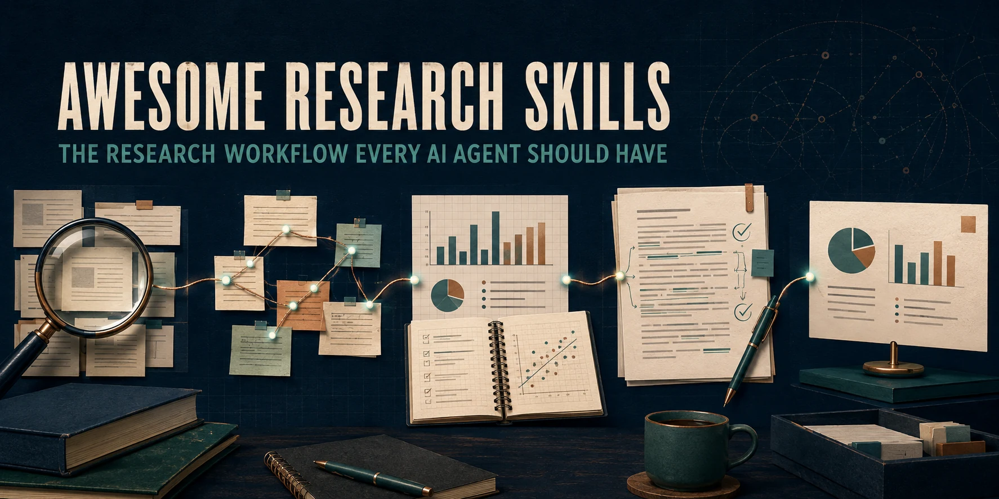

# Awesome Research Skills

[English](README.md) · [中文](README_CN.md) · [日本語](README_ja.md)

<p align="center">
  
</p>

> **모든 AI Agent가 갖춰야 할 연구 워크플로.**

논문 탐색과 이해부터 작성, 검토, 교정, 발표까지 연구의 전체 생애주기를 지원하도록 확장되는 오픈소스 Skill 스택입니다.

현재 연구 글쓰기, 충실한 학술 교정, 논문 기반 발표 제작 기능을 제공합니다. 더 많은 연구 단계가 계속 추가됩니다. 모든 단계에서 Agent가 출처, 검사 결과, 불확실성, 변경 사항을 명확히 밝히고 연구 내용을 조용히 바꾸지 않도록 설계합니다.

Codex, Claude Code 및 재사용 가능한 Skill 지시를 지원하는 다른 Agent에서 사용할 수 있습니다. 이 한국어 페이지는 핵심 요약본이며, 상세 문서는 영어와 중국어로 관리됩니다.

## 지금의 작업에서 시작하기

| 하고 싶은 일 | 사용할 모듈 | 제공 결과 |
|---|---|---|
| 아이디어, 메모, 데이터, 문헌을 논문으로 발전시키기 | **Research Writer** · [`science-research-writing`](skills/science-research-writing/SKILL.md) | 근거에 기반한 계획, 섹션 초고, 개정 또는 원고 감사 |
| 연구 내용을 바꾸지 않고 학술 영어 개선하기 | **Paper Polisher** · [`sci-ssci-polishing`](skills/sci-ssci-polishing/SKILL.md) | 투고용 학술 영어와 보존 감사 |
| 논문이나 연구 결과를 발표로 변환하기 | **Paper to Slides** · [`research-presentation`](skills/research-presentation/SKILL.md) | 편집 가능하고 출처에 기반한 덱 계획, 발표자 노트, 출처 맵, 시각 QA |

## 30초 설치

설치 도구는 Node.js 18 이상이 필요합니다. 현재 사용 가능한 기능을 모두 설치하려면 다음 명령을 실행하세요.

```bash
npx skills add Yila-AI/awesome-research-skills --global --agent codex --skill '*' --yes --copy
```

필요한 기능만 선택해 설치할 수도 있습니다.

```bash
# 논문 기획, 작성, 개정 또는 감사
npx skills add Yila-AI/awesome-research-skills --global --agent codex --skill science-research-writing --yes --copy

# 기존 원고 번역 또는 교정
npx skills add Yila-AI/awesome-research-skills --global --agent codex --skill sci-ssci-polishing --yes --copy

# 논문이나 연구 결과를 학술 발표로 변환
npx skills add Yila-AI/awesome-research-skills --global --agent codex --skill research-presentation --yes --copy
```

`npx skills add Yila-AI/awesome-research-skills --list`로 설치 가능한 모든 Skill을 확인할 수 있습니다.

## 연구 전체 생애주기

```text
질문 → 탐색 → 읽기 → 종합 → 설계 → 분석 → 작성 → 검토 → 교정 → 소통
```

| 개발 상태 | 연구 단계 |
|---|---|
| **현재 사용 가능** | 작성, 교정, 연구 발표 |
| **다음 개발 단계** | 문헌 검색, 논문 읽기, 근거 종합, 연구 검토 |
| **장기 범위** | 연구 설계, 데이터 분석, 출판, 더 넓은 연구 커뮤니케이션 |

장기적으로는 하나의 `$research` 진입점이 현재 연구 단계를 파악하고 적절한 전문 모듈로 작업을 연결합니다. 통합 진입점은 개발 중이며, 현재는 사용 가능한 각 Skill을 직접 호출합니다.

## 바로 사용하기

```text
Use $science-research-writing.
I have research materials but do not know how to organize them into a paper.
Here are my research question, methods, main results, and target journal:
[paste materials]
```

```text
Use $sci-ssci-polishing.
Please polish this Discussion paragraph without changing numbers, citations,
terminology, limitations, or claim strength.

Text:
[paste paragraph]
```

```text
Use $research-presentation to turn this paper into a source-grounded,
editable 10-minute research presentation with speaker notes.
```

## 왜 필요한가

AI를 활용한 학술 편집에서는 문장이 더 자연스러워지는 동안 다음과 같은 과학적 의미의 표류가 생길 수 있습니다.

- 신중한 결과가 인과적 주장으로 바뀌는 경우
- 연구의 한계가 사라지는 경우
- 숫자, 인용 또는 전문 용어가 변경되는 경우
- 문장이 근거가 지지하는 범위보다 강해지는 경우

이 Skill들은 문장의 명확성을 높이면서도 최종 학술적 판단을 저자에게 남겨 두도록 설계되었습니다.

## 재사용과 인용

```markdown
**Credit:** The evidence-preserving research-writing workflow is adapted from
[Yila-AI/awesome-research-skills](https://github.com/Yila-AI/awesome-research-skills),
including its Evidence-Preserving Draft Contract and Claim-Strength Contract.
```

평가, 코퍼스, 저작권 경계 및 상세한 사용 예시는 [영어 README](README.md)를 참고하세요.
