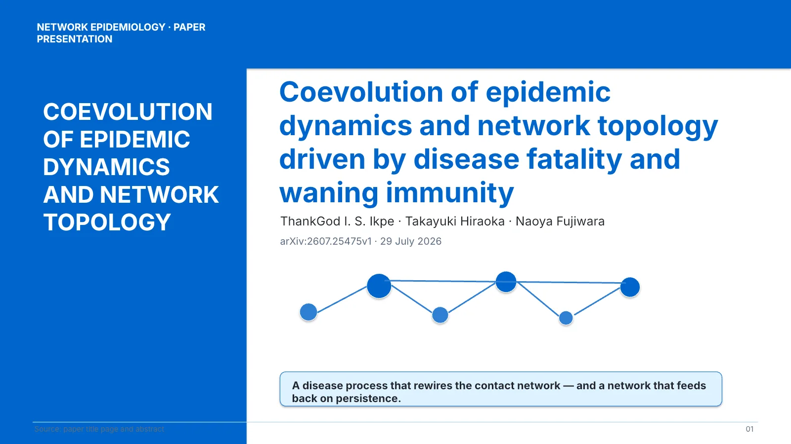
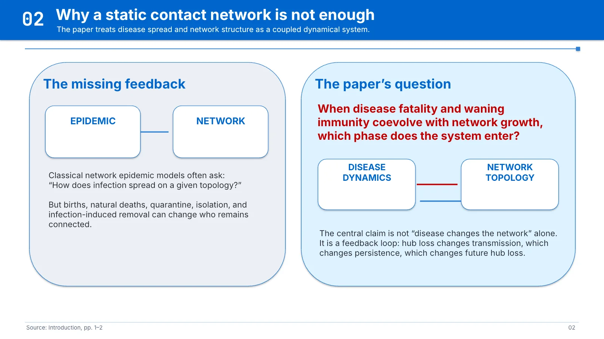
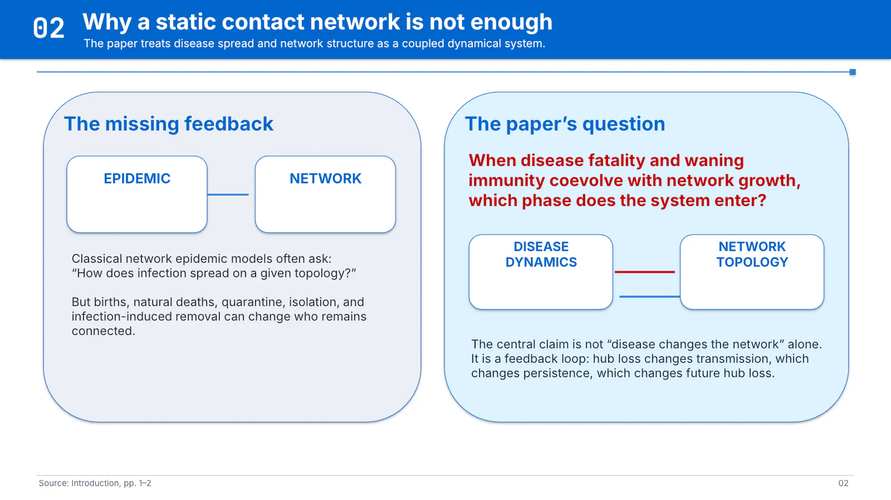
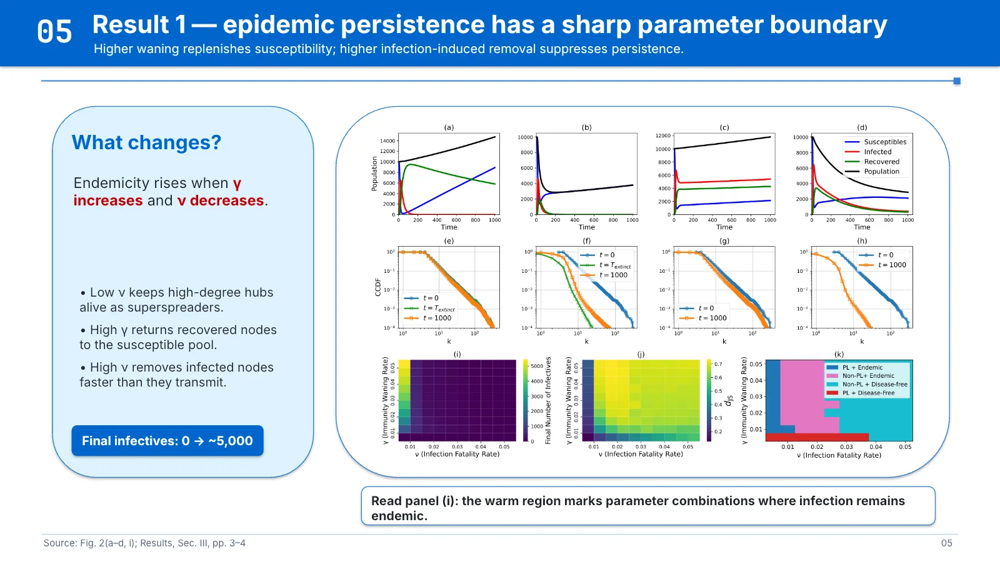
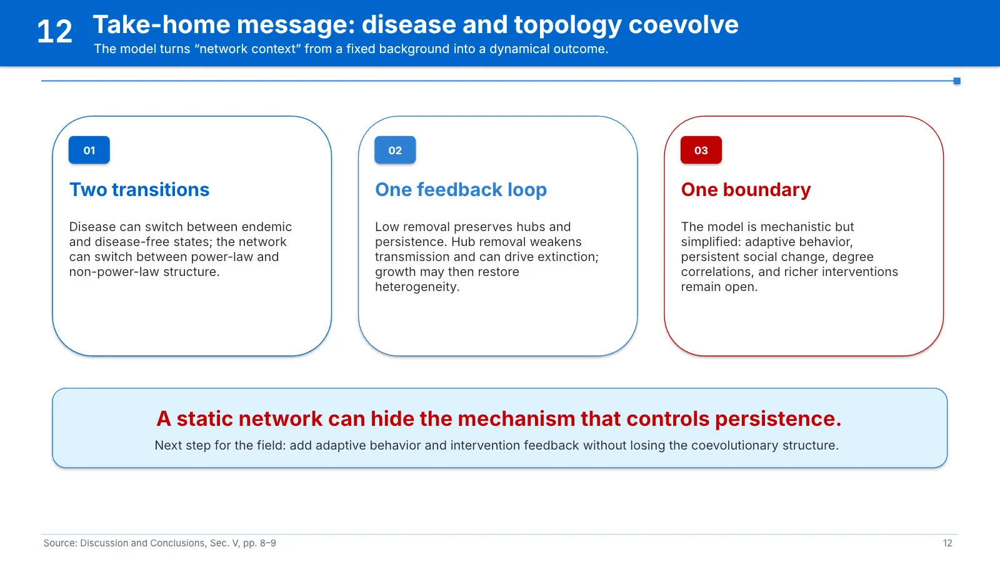
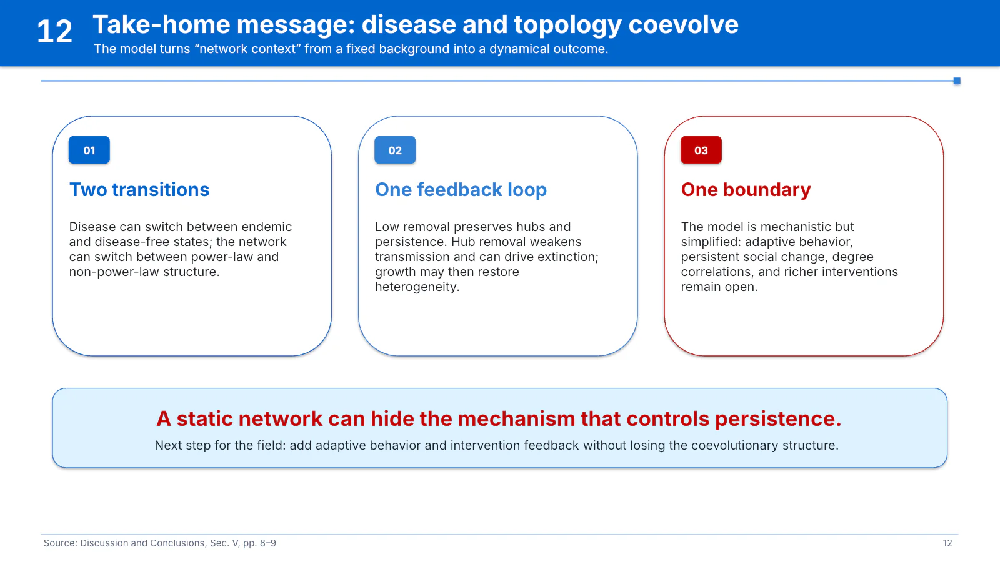

# Paper to Slides showcase：生态网络论文

This showcase shows two visual passes of the same paper-to-slides task. The
runtime Skill is [`research-presentation`](../../../skills/research-presentation/SKILL.md);
the public-facing title is **Paper to Slides**.

## Source paper

The source is the public preprint:

> Ikpe, T. I. S., Hiraoka, T., & Fujiwara, N. (2026). *Coevolution of epidemic
> dynamics and network topology driven by disease fatality and waning immunity*.
> arXiv:2607.25475.

- [arXiv abstract and paper page](https://arxiv.org/abs/2607.25475)
- [DOI landing link](https://doi.org/10.48550/arXiv.2607.25475)

The repository intentionally stores the canonical link and citation metadata,
not the source PDF. See [source-paper.md](source-paper.md) for the reuse note.

## Two generated visual passes

| Bright Azure v1 | Bright Azure v2 |
|---|---|
|  |  |
|  |  |
|  |  |
|  |  |

Each folder contains all 12 rendered slides. The two passes use the same
evidence and narrative contract while varying spacing, type scale, and visual
composition. The slides are demonstration artifacts, not source figures to be
reused independently of the paper attribution.

## What the showcase demonstrates

- **Source-grounded extraction:** title, research question, mechanism, results,
  limitations, and source anchors are carried through the deck.
- **Narrative planning:** the deck moves from the missing feedback loop to the
  model, parameter boundary, topology transition, and bounded takeaways.
- **Visual variation:** the same evidence can be rendered as two coherent
  academic themes without changing the scientific claim.
- **Render-ready output:** the repository Skill also provides speaker-note,
  source-map, PDF/PNG rendering, and structural QA guidance.

To reproduce the workflow with your own paper:

```text
Use $research-presentation.
Turn the attached paper into a 12-minute conference presentation.
Keep every quantitative claim traceable to a figure, table, section, page, or DOI.
Return an editable PPTX, speaker notes, source map, evidence ledger, and render QA report.
```
